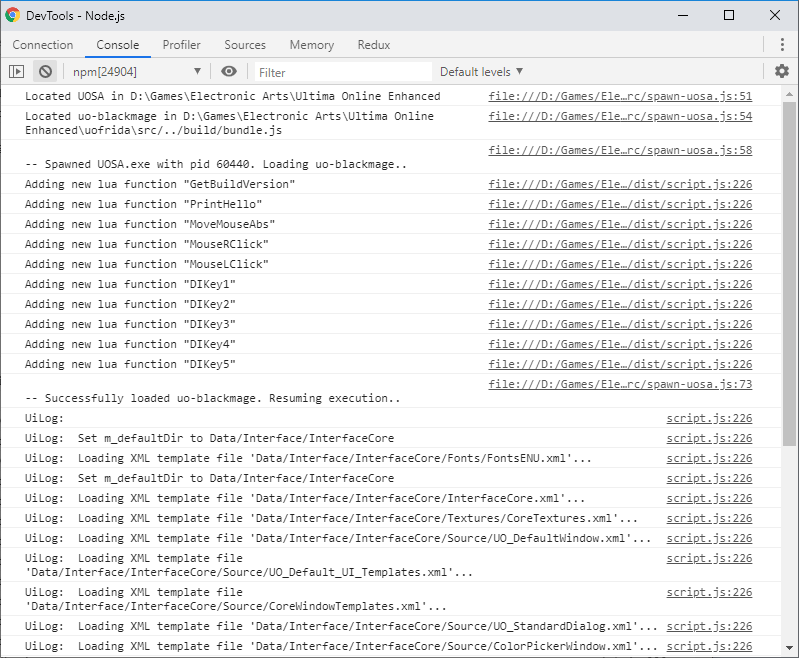

# uo-blackmage

uo-blackmage is a tool to add new features and fix bugs for the [Ultima Online Enhanced Client](https://uo.com).

It is based on [nodejs](https://nodejs.org/en/download/) and [frida.re](https://www.frida.re/)
and written in [Typescript](https://www.typescriptlang.org/).

Most features are aimed to be used by custom UI mods for the Ultima Online Enhanced Client and developing UI mods in general.

## Installation

1. [Install nodejs](https://nodejs.org/en/download/)
2. [Download](https://github.com/nufasou/uofrida/archive/master.zip) or clone this repository
3. Start the provided `blackmage.bat`

Running `blackmage.bat` will install all dependeciens if they are not found and then start Ultima Online with
uo-blackmage attached. If dependencies are already installed, it will just start Ultima Online with uo-blackmage attached.

You can also start UO by running `npm install` and `npm run uo` yourself.

## Main features

- New lua functions for mouse and keyboard automation (and more): [new lua functions](docs/lua-functions.md)
- Integration of UiLog (i.e. DebugWindow messages) outside of UOSA (in console window or chrome devtools)
- Enabling [os](https://www.lua.org/pil/contents.html#22), [io](https://www.lua.org/pil/contents.html#21) and [package](https://www.lua.org/pil/contents.html#15) lua standard libraries

## Making modifications / Development

After making changes in the `src/` directory it is needed to run `npm run build`.
During development `npm run watch` can be used to detect changes automatically and
rebuild uo-blackmage as needed.

Development is mostly done on vscode as it provides pretty good support for typescript and node.

When running `npm run debug`, nodejs will be started in inspect mode and spawn a debugger on a local port,
to which the chrome developer tools can connect:

## Misc Features

- Prints all functions registered available for use by the LUA UI (useful to find undocumented functions)
- Prints all loaded lua libraries
- LogUOPNames: Logs all filenames loaded from UOP archives into uop-names.txt (can be further processed for use in MythicPackageEditor)
- ... more undocumented

## Extra

There is a compiled LuaPlus dll in lib/. It's supposed to be very close to the LuaPlus version in UOSA. Feel free to compile it by yourself from sources but for sake of ease I just included my archived version.

Just got tired of messing with this in C++/C# (RIP UOBlackmage) and python (RIP uo-frida) so as of 2020 its nodejs only.
